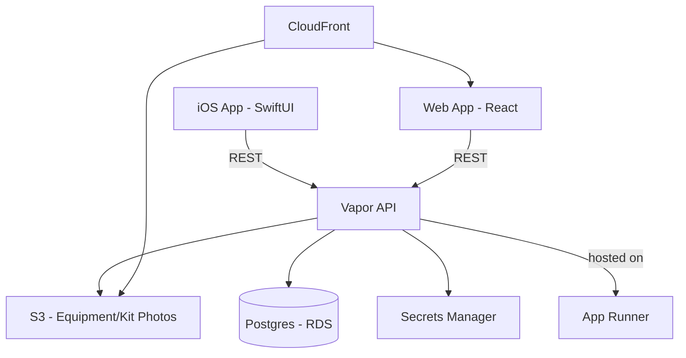

# steel-ledger-infra
Held together by thoughts, prayers, and point ties

# architecture


# Connecting to the EC2 Mac dev instance

Port 5900 (VNC) is never opened in the security group, so VNC is reached through an SSH tunnel. Assumes the instance is already set up — see [docs/mac-setup.md](./docs/mac-setup.md) for one-time setup (passwords, enabling Screen Sharing, etc.).

1. **Get the instance IP** (from `environments/dev`):
   ```
   terraform output mac_dev_public_ip
   ```
2. **Open the tunnel** (leave this terminal open):
   ```
   ssh -i <path-to-key>.pem -L 5900:localhost:5900 ec2-user@<public_ip>
   ```
3. **Connect a VNC client** (TightVNC recommended) to `localhost::5900` using the legacy VNC password.

**To disconnect:** close the VNC client, then `Ctrl-C` or exit the SSH session to tear down the tunnel.